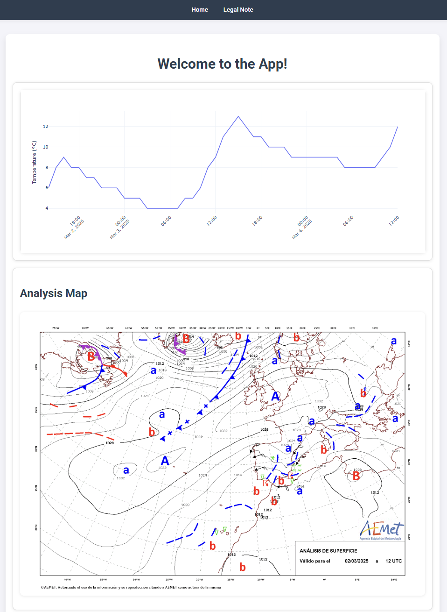
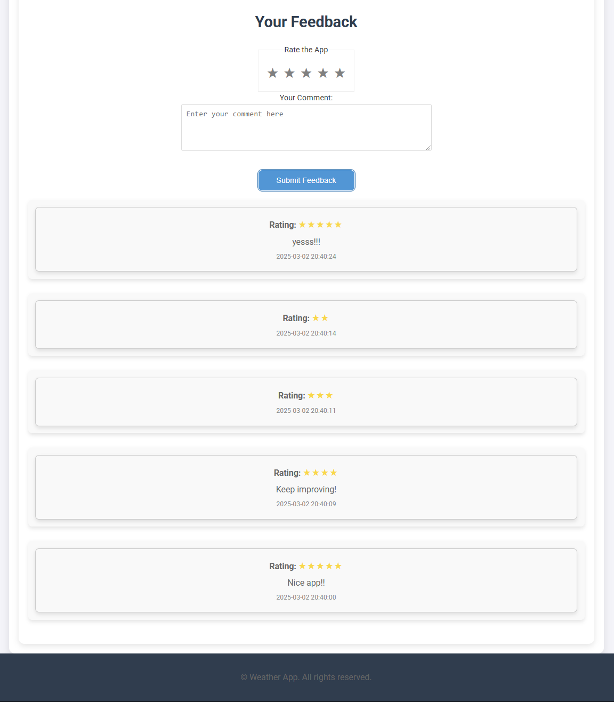
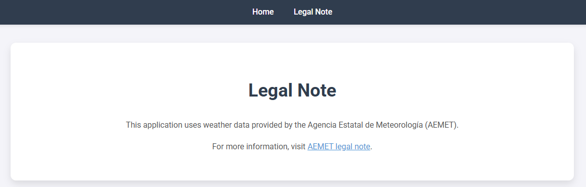

# Weather App

A simple weather application that provides weather forecasts and allows users to give feedback on the app. This app uses weather data from the **Agencia Estatal de Meteorología (AEMET)**, along with interactive feedback forms for users to share their ratings and comments.

## Features

- **Weather Forecasts**: Get the latest weather information, including visual plots and analysis maps.
- **User Feedback**: Users can provide feedback by giving a star rating (from 1 to 5 stars) and leaving a comment.
- **Legal Information**: A section that explains the legal note regarding the weather data source (AEMET).
- **Responsive Design**: The app is fully responsive and works well on both desktop and mobile devices.

## Screenshots

### Homepage with Weather Data


This screenshot shows the app's homepage, including the weather data and interactive plots.

### Feedback Form


Here is the feedback form where users can rate the app and leave comments.

### Legal Note Page


## Technologies Used

- **Flask & Python**: Python web framework used to build the backend.
- **HTML5 & CSS3**: Standard markup and styling for the frontend.
- **JavaScript (AJAX)**: Used for handling user interactions and submitting feedback asynchronously.
- **AEMET API**: Provides weather data for the app.

## Installation

Follow these steps to run the app locally:

### 1. Clone the repository
```bash
git clone https://github.com/your-username/weather-app.git
```

### 2. Create .env file in the root directory
```bash
AEMET_URL={AEMET_URL}
AEMET_APIKEY={AEMET_APIKEY}
```

### 3. Run docker compose
```bash
docker compose up --build
```

## Usage
*Feel free to explore the app and provide feedback on the weather data and app functionality!*
